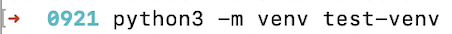
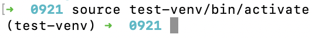
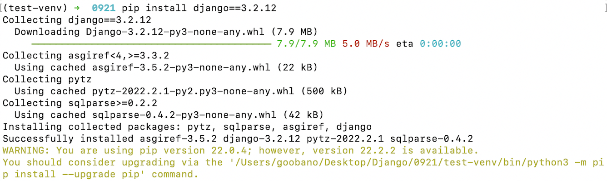
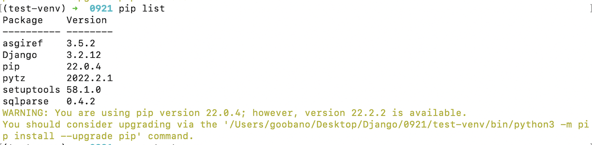
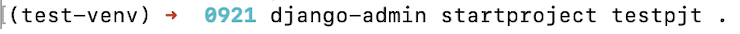
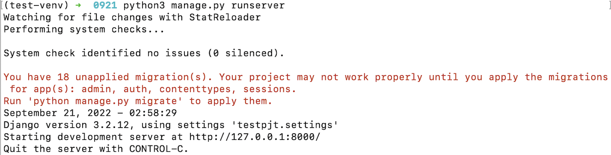
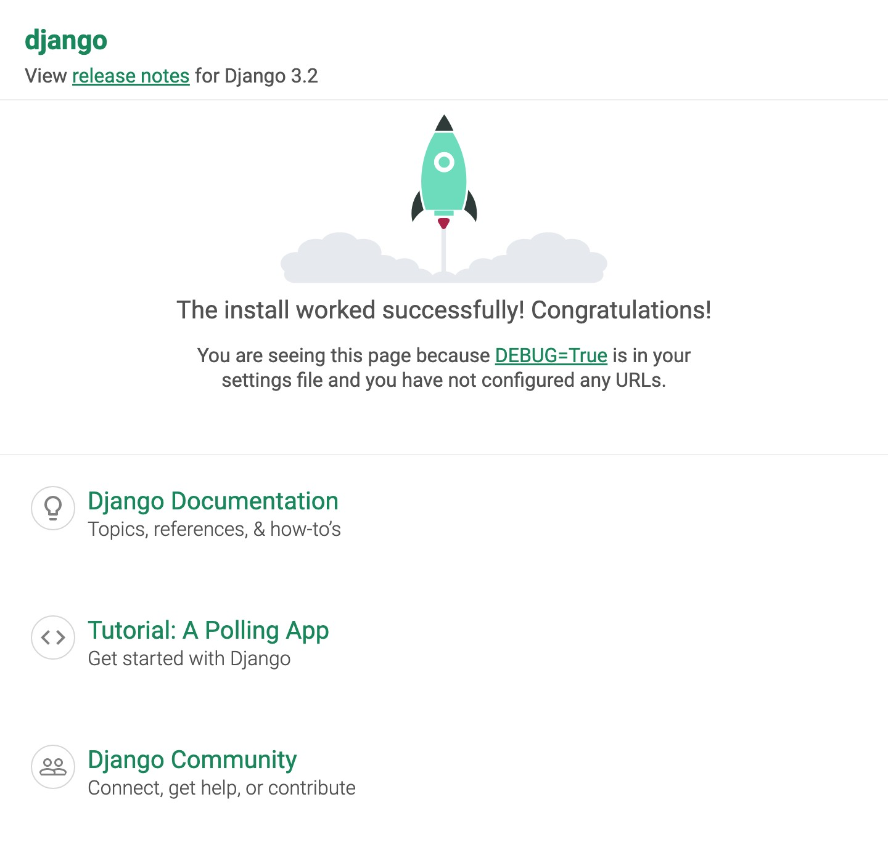

### `Django 개발 환경 설정 가이드`

***

#### ✔️ 가상환경 생성 / 실행

- `가상환경 만들기`

  - 먼저 가상환경을 만들 디렉터리를 새로 생성

  ```zsh
  mkdir [디렉터리 이름]
  ```

  - 만든 디렉터리로 이동해서 가상환경 생성

  ```zsh
  cd [디렉터리 이름]
  
  python3 -m venv [가상환경 이름]
  ```

  

- `가상환경 실행`

  ```zsh
  # windows
  source [가상환경 이름]/Script/activate
  
  # Mac
  source [가상환경 이름]/bin/activate
  ```

  


#### ✔️ Django LTS 버전 설치

- `LTS란?`
  - `Long-term support(LTS) releases`로 장기지원 되는 버전

- `설치`

  ```zsh
  pip install django==[설치할 버전]
  ```

  

  - 설치가 잘 되었는지 확인

  ```zsh
  pip list
  ```

  


#### ✔️ Django 프로젝트 생성 / 실행

- `생성`

  ```zsh
  django-admin startpoject [프로젝트 이름]
  ```

  

- `실행`

  ```zsh
  python3 manage.py runserver
  ```

  

  - 확인하기
    - 브라우저 주소창에 `localhost:8000` 입력
    - 아래 이미지처럼 나오면 제대로 실행된 것

  

  