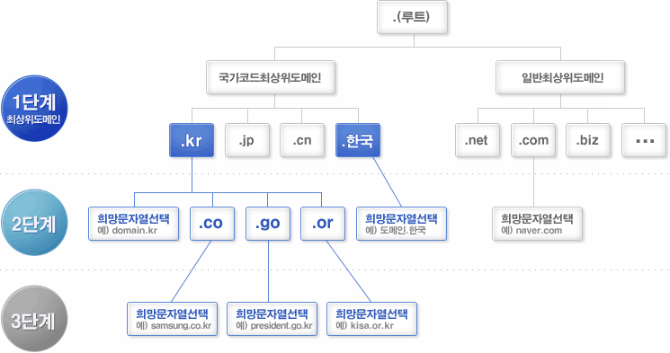

### `서버 기초`

***

#### 🧐 IP와 도메인은 무엇일까요?

-  IP란?

  - Internet Protocol
  - 인터넷에 연결되어 있는 모든 장치들을 식별할 수 있도록 각각의 장비에게 부여되는 고유 주소
  - `고정 IP`
    - 변하지 않고 컴퓨터에 고정적으로 부여된 IP
    - 한 번 부여되면 IP 반납을 하기 전까지는 다른 장비에 부여할 수 없는 고유의 IP
    - 보안성이 우수하기 때문에 보안이 필요한 업체나 기관에서 사용
  - `유동 IP`
    - 일정한 주기 또는 사용자들이 인터넷에 접속하는 매 순간마다 사용하고 있지 않은 IP 주소를 임시로 발급해 주는 IP
    - 대부분의 사용자는 유동 IP를 사용

- 도메인이란?

  - 인터넷에 연결된 컴퓨터를 사람이 쉽게 기억하고 입력할 수 있도록 문자(영문, 한글 등)로 만든 인터넷 주소

  - `도메인 체계`

    - `.` 또는 `루트(root)`라 불리는 도메인 이하에 역트리 구조로 구성되어 있음
    - 루트 도메인 바로 아래의 단계를 1단계 도메인 또는 최상위 도메인(TLD, Top Level Domain)이라고 부르며, 그 다음 단계를 2단계 도메인 (SLD, Second Level Domain)이라고 부름

    

  - `도메인 종류`

    - 국가 도메인(ccTLD, country code Top Level Domain)
      - 인터넷 상에서 국가를 나타내는 영문 및 자국어 도메인
      - 영문 국가도메인
        - `.kr(대한민국)`, `.jp(일본)`, .`cn(중국)`, `.us(미국)` 등 영문으로 구성
      - 자국어 국가도메인
        - `.한국(대한민국)`, `.중국(중국)`, `.러시아(러시아)`, `.이집트(이집트)`
    - 일반 도메인(gTLD, generic Top Level Domain)
      - `.com(회사)`, `.net(네트워크 관련기관)`, `org(비영리기관)`, `.biz(사업)` 등 등록인의 특성에 따라 사용할 수 있는 도메인
      - 조직, 목적, 분류 등 명칭을 영문 약자로 표현한 최상위 도메인
      - 영문은 3자리 이상, 영문 외 다국어는 2자리 이상

#### 🧐 클라이언트와 서버는 무엇일까요?

- 웹에 연결된 컴퓨터를 `클라이언트`와 `서버`라고 함

- `클라이언트`

  - 다른 프로그램에게 서비스를 요청하는 프로그램
  - 일반적인 웹 사용자의 인터넷이 연결된 장치들과 장치들에서 이용 가능한 웹에 접근하는 소프트웨어

- `서버`

  - 요청에 대해 응답을 해주는 프로그램
  - 웹페이지, 사이트, 앱을 저장하는 컴퓨터
  - 클라이언트의 장비가 웹페이지에 접근하길 원할 때, 서버로부터 클라이언트의 장치로 사용자의 웹 브라우저에서 보여지기 위한 웹페이지의 사본이 다운로드 됨

  

#### 🧐 정적 웹 사이트와 동적 웹 사이트의 차이점은 무엇일까요?

- `정적 웹 사이트(Static Web Site)`
  - 웹 서버에 미리 저장된 파일이 그대로 전달 되는 웹 페이지
  - 서버는 사용자의 요청에 해당하는 저장된 웹 페이지를 보냄
  - 사용자는 서버에 저장된 데이터가 변경되지 않는 한 고정된 웹 페이지를 보게 됨
  - 장점
    - 요청에 대한 파일만 전송하면 되기 때문에 추가적인 작업이 필요 없으므로 빠름
    - 웹 서버만 구축하면 되기 때문에 비용이 적음
  - 단점
    - 저장된 정보만 보여줄 수 있으므로 서비스가 한정적임
    - 추가, 수정, 삭제의 작업 모두 수동으로 이루어지기 때문에 관리가 힘듦
- `동적 웹 사이트(Dynamic Web Site)`
  - 웹 서버에 있는 데이터들을 스크립트에 의해 가공처리한 후 생성되어 전달 되는 웹 페이지
  - 서버는 사용자의 요청을 해석하여 데이터를 가공한 후 생성되는 웹 페이지를 보냄
  - 사용자는 상황, 시간, 요청 등에 따라 달라지는 웹 페이지를 보게 됨
  - 장점
    - 다양한 정보를 조합하여 동적으로 생성하여 제공 가능하여 서비스가 다양함
    - 웹 사이트 구조에 따라서 추가, 수정, 삭제 등의 작업이 용이하기 때문에 관리가 쉬움
  - 단점
    - 사용자에게 웹 페이지를 전달하기 전에 처리하는 작업이 필요하기 때문에 상대적으로 느림
    - 웹 서버 외에 추가적으로 처리를 위한 어플리케이션 서버(WEV Application Server)가 필요하기 때문에 추가 비용이 듦

#### 🧐 HTTP는 무엇이고 요청과 응답 메시지 구성은 어떻게 되나요?

- `HTTP란?`

  - Hyper Text Transfer Protocol
  - 서버와 클라이언트가 인터넷 상에서 HTML 문서를 주고받을 수 있도록 하기 위해 만든 통신 규약
  - 클라이언트가 데이터를 요청하면 그 요청을 처리하여 서버가 다시 클라이언트에게 응답

  

- `HTTP 특징`

  - 무상태(Stateless) / 비연결성 (Connectionless)
    - 모든 요청과 응답은 이전의 것들과는 상관없이 독립적으로 이루어짐
    - 즉, 모든 transaction이 단 한 번의 응답과 요청 사이클을 가지며, 이 사이클이 끝나면 연결이 끊김
  - 해당 요청에 필요한 모든 정보를 처음부터 보내야 함
  - 불특정 다수를 대상으로 하는 서비스에 적합
  - 무상태의 단점을 보완하기 위해 쿠키, 세션, 로컬 스토리지 등을 사용하여 이전의 상태를 짧은 기간에서 반영구적으로 기억할 수 있게 할 수 있음

- `요청과 응답 메시지 구성`

  - 요청
    - 클라이언트가 서버에 보내는 메시지
    - request line
      - 구조
        - HTTP method SP(공백) request-target SP HTTP-version CRLF(ENTER)
      - 첫 번째 요소 : HTTP method
        - 서버가 수행해야 할 동작을 나타냄
        - GET, PUSH, DELETE, POST 등이 있음
        - GET은 리소스를 클라이언트로 조회해 달라는 의미
        - POST는 요청 내역을 처리해 달라는 의미
      - 두 번째 요소 : request-target
        - 주로 URL, PORT, 도메인 등이 붙는 절대 경로
        - `/`로 시작하는 path
      - 세 번째 요소 : HTTP-version
        - 요청 메시지에서 사용해야 할 HTTP의 버전을 나타냄
  - 응답
    - Status line
      - 구조
        - HTTP-version SP status-code SP reason-phrase CRLF(ENTER)
      - 첫 번째 요소 : HTTP-version
        - HTTP의 버전을 나타냄
      - 두 번째 요소 : status-code
        - 요청의 성공 혹은 실패를 나타냄
        - 예) HTTP 상태코드 200은 성공, 400은 클라이언트 요청에 에러가 발생 했다는 의미
      - 세 번째 요소 : reason-phrase
        - 사람이 이해할 수 있는 간단한 문구 기재

#### 🧐 프레임워크는 무엇일까요?

- `사전적 정의`
  - 프로그래밍에서 특정 운영 체제를 위한 응용 프로그램 표준 구조를 구현하는 클래스와 라이브러리의 모임
  - 목적에 따라 효율적으로 구조를 짜놓는 개발 방식
- `프레임워크의 종류`
  - Spring Framework
    - JAVA 개발에 있어서 대표적인 프레임워크
    - 엔터프라이즈급 애플리케이션 개발에 필요로 하는 경량형 프레임워크
    - 전자정부 표준프레임워크의 기반이 되는 기술이기 때문에 활용도가 높아지고 있음
    - 특징
      - 경량컨테이너로 라이프사이클을 관리하고 필요한 객체를 스프링으로부터 받아옴
      - DI 지원하여 객체간의 의존관계 설정이 가능
      - AOP 지원
      - POJO 방식으로 자바 객체는 특정한 인터페이스를 구현하고 클래스 상속이 필요하지 않음
      - 트랜젝션 처리를 위한 일관된 방법을 제공
      - 영속성 관련 다양한 API를 지원
      - API 연동을 지원
  - Angular JS
    - 자바스크립트 기반의 프레임워크
    - 기본적으로 MVC(Model-View-Controller) 모델 지원과 같은 다른 웹 어플리케이션 프레임워크에서도 지원하는 기능 제공
    - 자바스크립트 또는 제이쿼리로 만든 코드의 길이를 더욱 단순화 가능
    - 직관적으로 소스를 이해할 수 있게 됨
    - 특징
      - 작성해야 하는 자바스크립트의 코드량을 줄여줌
      - 앵귤러 JS의 데이터 모델은 단순 자바스크립트 객체
      - 재사용이 쉬운 정적인 UI 컴포넌트를 만들 수 있음
      - HTML, CSS 개발자와 자바스크립트 개발자를 명확하게 분리
  - Django Framework
    - 파이썬으로 작성된 오픈 소스 웹 애플리케이션 프레임워크
    - 쉽고 빠르게 웹 사이트를 개발할 수 있도록 돕는 구성 요소로 이루어져 있음
    - 개발 기간을 상당히 단축 시킬 수 있음
    - 특징
      - MVC 패턴 기반 MTV
      - ORM(Object-relational mapping) 기능 지원
      - 쉬운 DB 관리를 위해 프로젝트를 생성하면서 관리자 기능 제공
      - 쉬운 URL 파싱 기능 지원
      - 동일한 소스코드에서 다른 나라에서 용이하도록 번역, 날짜/시간/숫자 등의 포맷 타임존 지정 등의 기능 제공